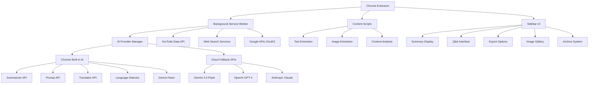

# TabSense

<div align="center">
  
  
  
</div>

<div align="center">
  <h3>🚀 AI-powered research assistant for Chrome</h3>
  <p>Summarize, analyze, and query your open tabs using Chrome's built-in AI</p>
</div>

---

## 🎯 What is TabSense?

TabSense transforms your browsing experience by providing intelligent assistance directly in Chrome. It combines Chrome's built-in AI capabilities with smart content analysis to deliver comprehensive summaries, cross-tab Q&A, image analysis, and powerful export options—all without leaving your browser.

**The Problem**: Users constantly switch between Chrome and external AI tools for summaries, translations, and analysis. This context switching disrupts workflow and requires managing multiple services.

**The Solution**: TabSense integrates AI directly into Chrome, prioritizing on-device processing with Chrome's built-in AI while seamlessly falling back to cloud APIs when needed. This eliminates context switching and makes browsing truly self-contained.

## ✨ Core Features

### 🧠 Multi-Tab Intelligence
- **Smart Summarization**: Automatically summarize web pages and articles with category-specific formatting
- **Cross-Tab Analysis**: Ask questions across multiple open tabs or within specific categories
- **Category-Wide Q&A**: Query data across all tabs in categories like "news", "academic", "finance", or "YouTube"
- **Consolidated Overview**: Get insights from all your open tabs at once

### 🎯 Smart Categorization
- **AI-Powered Classification**: Automatically categorizes tabs as news, blog, reference, academic, finance, YouTube
- **Content-Based Analysis**: Uses page content, not just URLs, for accurate categorization
- **Category Filtering**: Filter tabs by category for focused analysis

### 🔧 AI-Powered Tools
- **🌐 Translation**: Instant translation using Chrome Translator API with cloud fallback
- **✍️ Writing Assistance**: AI-powered proofreading and writing using Chrome Proofreader API
- **🖼️ Image Analysis**: Analyze diagrams, charts, and images using Chrome Prompt API & Gemini Vision
- **📊 YouTube Integration**: Extract metadata, comments, and generate comprehensive summaries with sentiment analysis

### 💾 Export & Share
- **Multiple Formats**: Export to CSV, Excel (.xls), Google Sheets, or Markdown reports
- **Google Integration**: Direct export to Google Sheets and Google Docs via OAuth2
- **Sentiment Analysis**: YouTube comments categorized by sentiment with visual indicators
- **Rich Reports**: Formatted Markdown reports with citations and sources

### 🔒 Privacy & Performance
- **Chrome Built-in AI First**: Prioritizes Chrome's on-device AI (Summarizer, Prompt, Translator, Language Detector, Gemini Nano)
- **Smart Fallback**: Seamlessly falls back to cloud APIs (Gemini, OpenAI, Anthropic) when needed
- **Fast & Efficient**: Background processing without slowing down browsing
- **Model Download Progress**: Visual indicators show when Chrome AI models are downloading

## 🎯 Perfect For

| User Type | Use Case |
|-----------|----------|
| **Students** | Research papers, study materials, assignment analysis |
| **Researchers** | Academic papers, news analysis, literature reviews |
| **Product Managers** | Competitive analysis, user research, market insights |
| **Journalists** | News gathering, fact-checking, source analysis |
| **Knowledge Workers** | Efficient information processing, content creation |

## 🚀 Quick Start

### Installation
```bash
# Clone the repository
git clone https://github.com/yourusername/tabsense.git
cd tabsense

# Install dependencies
npm install

# Build the extension
npm run build

# Load in Chrome
# 1. Open chrome://extensions/
# 2. Enable "Developer mode"
# 3. Click "Load unpacked"
# 4. Select the 'dist' folder

# Configure API Keys (Optional)
# 1. Click the TabSense icon
# 2. Go to Settings (gear icon)
# 3. Add API keys for external AI providers (Gemini, OpenAI, Anthropic)
# 4. Add YouTube Data API key for enhanced YouTube features
# 5. Enable Google Sheets/Docs integration for direct exports
```

### Usage
1. **Open multiple tabs** with content you want to analyze
2. **Click the TabSense icon** to open the sidebar
3. **Watch AI summarize** your tabs automatically with category-specific formatting
4. **Ask questions** like:
   - "What are the main themes across these articles?" (cross-tab)
   - "Summarize all news articles" (category-wide)
   - "Describe the chart in this finance article" (image analysis)
   - "What do YouTube comments say about this video?" (YouTube analysis)
5. **Export results** to CSV, Excel, Google Sheets, Google Docs, or Markdown
6. **View images** by clicking the image icon when available
7. **Browse archive** to access previous conversations and summaries

## 🏗️ Architecture



## 🔧 Technical Stack

- **Extension**: Chrome Manifest V3
- **Frontend**: React + TypeScript + Tailwind CSS
- **Build**: Vite + esbuild
- **Storage**: Chrome Storage API + IndexedDB

### Chrome Built-in AI APIs (Primary)
- **Summarizer API**: On-device text summarization
- **Prompt API**: Multimodal AI (text + images)
- **Translator API**: Language translation
- **Language Detector API**: Automatic language detection
- **Proofreader API**: Writing assistance
- **Gemini Nano**: On-device AI model

### External APIs (Fallback)
- **Google Gemini 2.0 Flash**: Advanced AI capabilities with vision support
- **OpenAI GPT-4**: Cloud-based AI with multimodal support
- **Anthropic Claude**: Alternative AI provider

### Data & Integration APIs
- **YouTube Data API v3**: Video metadata, comments, transcripts
- **NewsAPI**: News article search and verification
- **Wikipedia API**: Fact-checking and reference data
- **Serper.dev**: Web search and context enhancement
- **Google Sheets API**: Direct export to spreadsheets
- **Google Docs API**: Direct export to documents

### Browser APIs
- **Chrome Storage API**: Local data persistence
- **Chrome Downloads API**: File exports
- **Chrome Identity API**: OAuth2 authentication
- **Chrome Tabs API**: Tab management and content extraction

## 📊 Roadmap

### Phase 1: MVP ✅ (Completed)
- [x] Basic Chrome extension structure
- [x] Text summarization (Chrome Summarizer API + Cloud fallback)
- [x] Cross-tab Q&A with context awareness
- [x] Smart page categorization (news, blog, reference, academic, finance, YouTube)
- [x] Conversation archiving and history
- [x] Chrome Web Store ready

### Phase 2: Enhanced Features ✅ (Completed)
- [x] Image analysis with Chrome Prompt API & Gemini Vision
- [x] YouTube integration with Data API (comments, metadata, sentiment)
- [x] Comprehensive YouTube summaries with key takeaways and comment analysis
- [x] Export to CSV, Excel, Google Sheets, Google Docs
- [x] Markdown report generation with citations and formatting
- [x] Category-wide Q&A across multiple tabs
- [x] Image extraction and visualization with horizontal scrolling
- [x] Chrome AI model download progress indicators
- [x] Enhanced categorization (news, blog, reference, academic, finance, YouTube)
- [x] Retry mechanism for failed AI responses
- [x] Conversation archiving with image preservation
- [x] Inline image display for image-related questions
- [ ] Audio transcription
- [ ] Voice input/output

### Phase 3: Advanced Features (Planned)
- [ ] Multi-browser support (Firefox, Edge)
- [ ] Offline mode with local AI
- [ ] Team collaboration & sharing
- [ ] Enterprise features (SSO, analytics)
- [ ] API platform for integrations
- [ ] Browser extension marketplace distribution

## 🤝 Contributing

We welcome contributions! Here's how to get started:

1. **Fork the repository**
2. **Create a feature branch**: `git checkout -b feature/amazing-feature`
3. **Make your changes** and test thoroughly
4. **Commit your changes**: `git commit -m 'Add amazing feature'`
5. **Push to the branch**: `git push origin feature/amazing-feature`
6. **Open a Pull Request**

### Development Setup
```bash
# Install dependencies
npm install

# Start development server
npm run dev

# Run tests
npm test

# Build for production
npm run build
```

## 📄 License

This project is licensed under the MIT License - see the [LICENSE](LICENSE) file for details.

- **Email**: lagatbenaiah24@gmail.com

---

<div align="center">
  <p><strong>TabSense - Making browsing smarter, one tab at a time.</strong></p>
  <p>Built with ❤️ for the Chrome BUILT-IN AI Challenge 2025</p>
</div>
