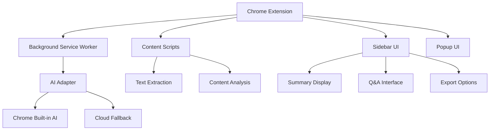

# TabSense

<div align="center">
  
  
  
</div>

<div align="center">
  <h3>🚀 AI-powered research assistant for Chrome</h3>
  <p>Summarize, analyze, and query your open tabs using Chrome's built-in AI</p>
</div>

---

## 🎯 What is TabSense?

TabSense transforms your browsing experience by providing intelligent assistance directly in Chrome. Instead of switching between tabs and external AI tools, TabSense brings AI capabilities to your browser.

**The Problem**: Users constantly switch between Chrome and ChatGPT/AI tools for summaries, translations, and analysis.

**The Solution**: TabSense integrates AI directly into Chrome, eliminating context switching and making browsing self-contained.

## ✨ Core Features

### 🧠 Multi-Tab Intelligence
- **Smart Summarization**: Automatically summarize web pages and articles
- **Cross-Tab Analysis**: Ask questions across multiple open tabs
- **Consolidated Overview**: Get insights from all your open tabs at once

### 🔧 AI-Powered Tools
- **🌐 Translation**: Instant translation of foreign content
- **✍️ Proofreading**: AI-powered writing assistance
- **🖼️ Image Analysis**: Explain charts, graphs, and images
- **🎙️ Audio Transcription**: Convert audio/video to text

### 🔒 Privacy & Performance
- **Local Processing**: Uses Chrome's built-in AI (Gemini Nano)
- **No External APIs**: Your data stays on your device
- **Fast & Efficient**: Background processing without slowing down browsing

## 🎯 Perfect For

| User Type | Use Case |
|-----------|----------|
| **Students** | Research papers, study materials, assignment analysis |
| **Researchers** | Academic papers, news analysis, literature reviews |
| **Product Managers** | Competitive analysis, user research, market insights |
| **Journalists** | News gathering, fact-checking, source analysis |
| **Knowledge Workers** | Efficient information processing, content creation |

## 🚀 Quick Start

### Installation
```bash
# Clone the repository
git clone https://github.com/yourusername/tabsense.git
cd tabsense

# Install dependencies
npm install

# Build the extension
npm run build

# Load in Chrome
# 1. Open chrome://extensions/
# 2. Enable "Developer mode"
# 3. Click "Load unpacked"
# 4. Select the 'dist' folder
```

### Usage
1. **Open multiple tabs** with content you want to analyze
2. **Click the TabSense icon** to open the sidebar
3. **Watch AI summarize** your tabs automatically
4. **Ask questions** like "What are the main themes across these articles?"
5. **Export results** to Markdown, Google Docs, or clipboard

## 🏗️ Architecture



## 🔧 Technical Stack

- **Extension**: Chrome Manifest V3
- **Frontend**: React + TypeScript + Tailwind CSS
- **AI**: Chrome's built-in AI APIs (Gemini Nano)
- **Build**: Vite + esbuild
- **Storage**: Chrome Storage API + IndexedDB

## 📊 Roadmap

### Phase 1: MVP ✅ (Completed)
- [x] Basic Chrome extension structure
- [x] Text summarization (Chrome Summarizer API + Cloud fallback)
- [x] Cross-tab Q&A with context awareness
- [x] Smart page categorization (news, blog, reference, academic, finance, YouTube)
- [x] Conversation archiving and history
- [x] Chrome Web Store ready

### Phase 2: Enhanced Features ✅ (In Progress)
- [x] Image analysis with Chrome Prompt API & Gemini Vision
- [x] YouTube integration with Data API (comments, metadata, sentiment)
- [x] Export to CSV, Excel, Google Sheets, Google Docs
- [x] Markdown report generation
- [x] Category-wide Q&A across multiple tabs
- [x] Image extraction and visualization
- [ ] Audio transcription
- [ ] Voice input/output

### Phase 3: Advanced Features (Planned)
- [ ] Multi-browser support (Firefox, Edge)
- [ ] Offline mode with local AI
- [ ] Team collaboration & sharing
- [ ] Enterprise features (SSO, analytics)
- [ ] API platform for integrations
- [ ] Browser extension marketplace distribution

## 🤝 Contributing

We welcome contributions! Here's how to get started:

1. **Fork the repository**
2. **Create a feature branch**: `git checkout -b feature/amazing-feature`
3. **Make your changes** and test thoroughly
4. **Commit your changes**: `git commit -m 'Add amazing feature'`
5. **Push to the branch**: `git push origin feature/amazing-feature`
6. **Open a Pull Request**

### Development Setup
```bash
# Install dependencies
npm install

# Start development server
npm run dev

# Run tests
npm test

# Build for production
npm run build
```

## 📄 License

This project is licensed under the MIT License - see the [LICENSE](LICENSE) file for details.

- **Email**: lagatbenaiah24@gmail.com

---

<div align="center">
  <p><strong>TabSense - Making browsing smarter, one tab at a time.</strong></p>
  <p>Built with ❤️ for the Chrome BUILT-IN AI Challenge 2025</p>
</div>
